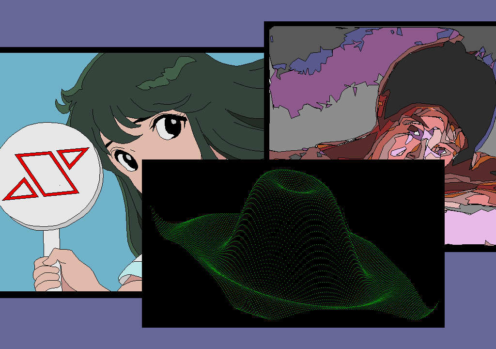

# CG sample programs for micropython-x68k

[MicroPython for X68000](https://github.com/yunkya2/micropython-x68k)でCGお絵描きのプログラムを作りました。X-BASIC風の関数群パッケージ[xbasip](https://github.com/nozwas/xbasip-x68k)を同梱し使用しています。

## 実行方法

３つのプログラムから構成されています。

* `cg01` -- アニメ風CG
* `cg02` -- ビデオデジタイズ風CG
* `cg03` -- レトロな３次元CG


フォルダ直下にプリコンパイル済みの`*.mpy`ファイルがありますので、下記のように`-m`オプションを付けてmicropythonを実行してください。

```bash
micropython.x -m cg01
micropython.x -m cg02
micropython.x -m cg03
```

もしくは、３つのプログラムを順に実行するバッチファイル`run_cgsample.bat`をお使いください。cg03は描画完了まで時間がかかるので、何かキーを押すと途中で終了するようになっています。

## ファイル構成

`cg_src`フォルダにソースファイル`*.py`が格納されています。

```text
├── run_cgsample.bat
├── cg01.mpy
├── cg02.mpy
├── cg03.mpy
├── cg_src
│   ├── cg01.py
│   ├── cg02.py
│   └── cg03.py
├── xbasip
│   ├── __init__.mpy
│   ├── audio.mpy
│   ├── basic.mpy
│   ├── graph.mpy
│   ├── mouse.mpy
│   ├── music.mpy
│   ├── sprite.mpy
│   ├── stick.mpy
│   └── tgraph.mpy
└── README.md
```

## xbasipパッケージについて

X-BASIC風の関数群パッケージ`xbasip`を使用し、`line()`や`paint()`などの関数で描画しています。プリコンパイル済みバイナリファイルを同梱していますが、ご興味のある方は[公開サイト](https://github.com/nozwas/xbasip-x68k)を覗いてみてください。xbasipパッケージはグラフィックの他、下記のモジュールから構成されています。

* `console` -- コンソール関数群
* `graph` -- グラフィック関数群
* `sprite` -- スプライト関数群
* `audio` -- ADPCM関数群
* `music` -- FM音源関数群
* `mouse` -- マウス関数群
* `stick` -- ジョイスティック関数群
* `tgraph` -- テキストグラフィック関数群

nozwas/のずわす(https://github.com/nozwas)